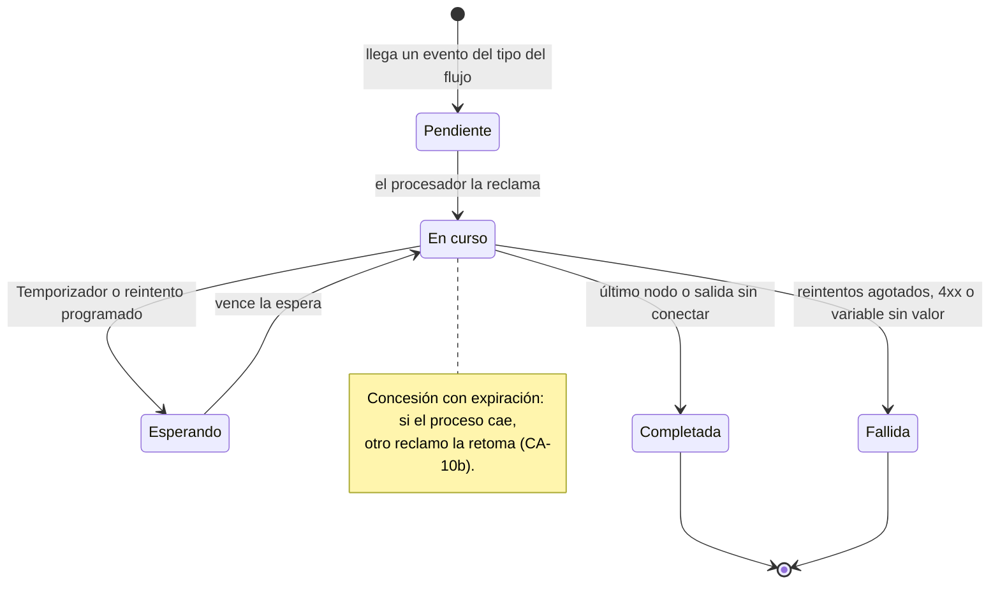
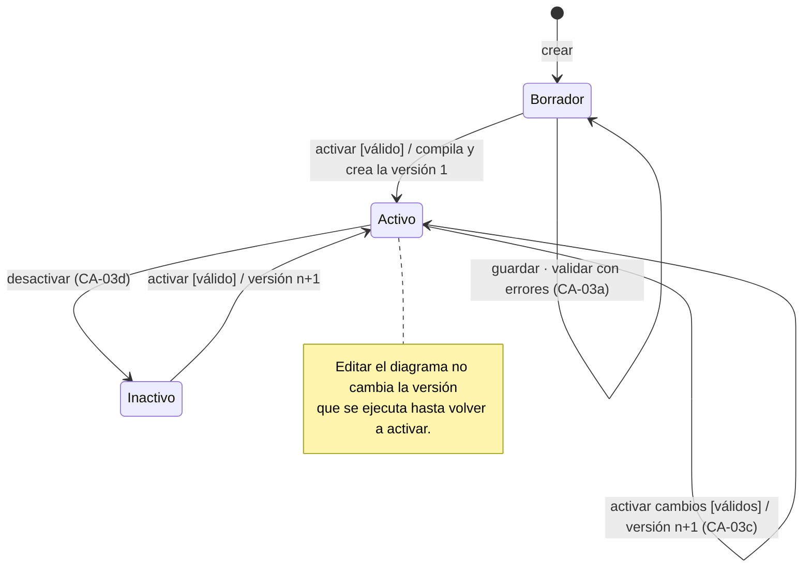

# 5. Máquinas de estado

## 5.1 Ejecución (requisitos §5.1, RN-30, AR-18)

```mermaid
stateDiagram-v2
  state "Pendiente" as Pendiente
  state "En curso" as EnCurso
  state "Esperando" as Esperando
  state "Completada" as Completada
  state "Fallida" as Fallida

  [*] --> Pendiente : llega un evento del tipo del flujo
  Pendiente --> EnCurso : el procesador la reclama
  EnCurso --> Esperando : Temporizador o reintento programado
  EnCurso --> Completada : último nodo o salida sin conectar
  EnCurso --> Fallida : reintentos agotados, 4xx o variable sin valor
  Esperando --> EnCurso : vence la espera
  Completada --> [*]
  Fallida --> [*]

  note right of EnCurso
    Concesión con expiración: si el proceso cae,
    otro reclamo la retoma (CA-10b).
  end note
```

## 5.2 Flujo (requisitos §5.2, RN-11)

```mermaid
stateDiagram-v2
  [*] --> Borrador : crear
  Borrador --> Borrador : guardar · validar con errores (CA-03a)
  Borrador --> Activo : activar [válido] / compila y crea la versión 1
  Activo --> Activo : activar cambios [válidos] / versión n+1 (CA-03c)
  Activo --> Inactivo : desactivar (CA-03d)
  Inactivo --> Activo : activar [válido] / versión n+1

  note right of Activo
    Editar el diagrama no cambia la versión
    que se ejecuta hasta volver a activar.
  end note
```
