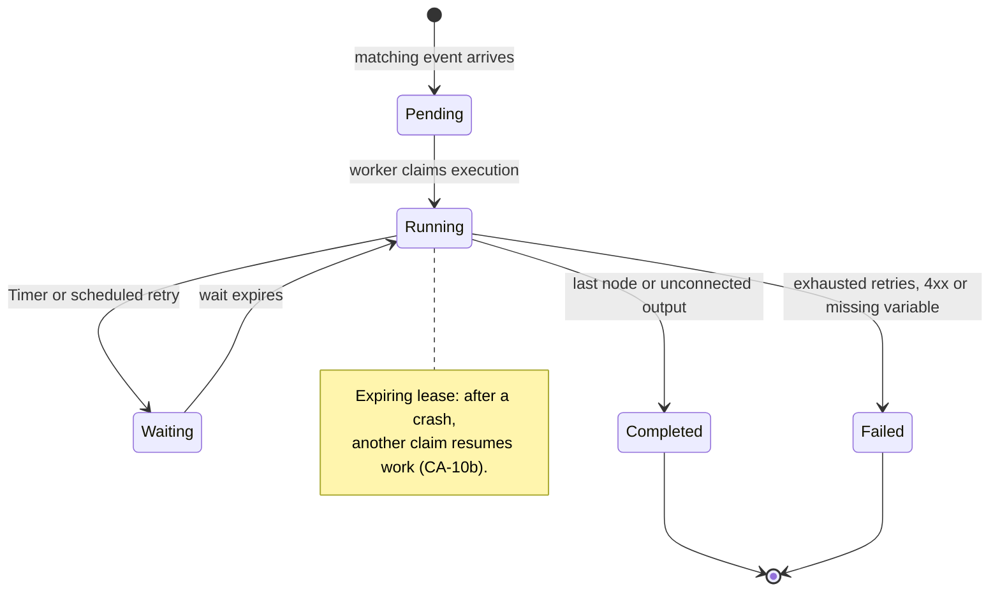
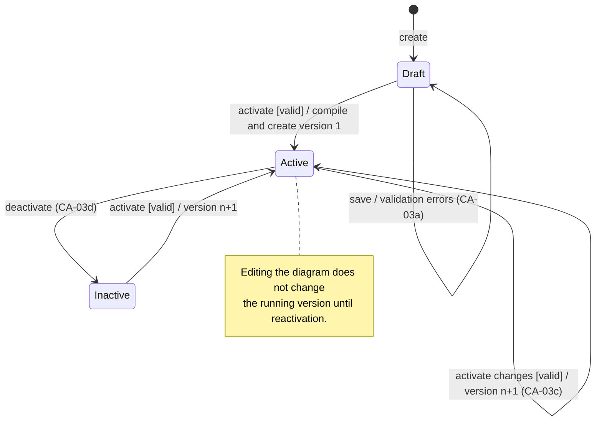

# 5. State machines

## 5.1 Execution (requirements §5.1, RN-30, AR-18)

```mermaid
stateDiagram-v2
  [*] --> Pending : matching event arrives
  Pending --> Running : worker claims execution
  Running --> Waiting : Timer or scheduled retry
  Running --> Completed : last node or unconnected output
  Running --> Failed : exhausted retries, 4xx or missing variable
  Waiting --> Running : wait expires
  Completed --> [*]
  Failed --> [*]
  note right of Running
    Expiring lease: after a crash,
    another claim resumes work (CA-10b).
  end note
```

## 5.2 Workflow (requirements §5.2, RN-11)

```mermaid
stateDiagram-v2
  [*] --> Draft : create
  Draft --> Draft : save / validation errors (CA-03a)
  Draft --> Active : activate [valid] / compile and create version 1
  Active --> Active : activate changes [valid] / version n+1 (CA-03c)
  Active --> Inactive : deactivate (CA-03d)
  Inactive --> Active : activate [valid] / version n+1
  note right of Active
    Editing the diagram does not change
    the running version until reactivation.
  end note
```
